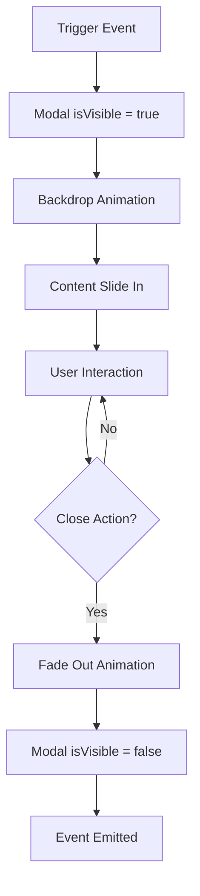

# 🎭 Sistema de Diálogos Modales - AtroPELLO

## 📋 Índice
- [Descripción General](#descripción-general)
- [Arquitectura del Modal](#arquitectura-del-modal)
- [Componente Modal](#componente-modal)
- [Uso en el Juego](#uso-en-el-juego)
- [Personalización](#personalización)
- [Ejemplos de Implementación](#ejemplos-de-implementación)
- [Mejores Prácticas](#mejores-prácticas)

---

## 🎯 Descripción General

El sistema de diálogos modales de AtroPELLO está diseñado para proporcionar **experiencias interactivas inmersivas** sin interrumpir el flujo del juego. Utiliza overlays con efectos visuales modernos y es completamente reutilizable.

### 🎮 Filosofía de Diseño
> **"Información clara, interacción fluida, inmersión preservada"**

---

## 🏗️ Arquitectura del Modal

### 🔄 Flujo de Vida del Modal



### 📱 Capas del Sistema

```
Z-Index Hierarchy:
├── Game Canvas (z-index: 0)
├── UI Elements (z-index: 100-999)
└── Modal System (z-index: 10000)
    ├── Backdrop (blur + overlay)
    └── Modal Content (centered)
```

---

## 🧩 Componente Modal

### 📂 Ubicación
`src/app/components/modal/`

### 🔧 Estructura del Componente

#### **HTML Template**
```html
<!-- modal.html -->
@if (isVisible) {
  <div class="modal-backdrop" (click)="onBackdropClick()">
    <div class="modal-content" (click)="$event.stopPropagation()">
      <div class="modal-header">
        <h2>{{ title }}</h2>
        <button class="close-button" (click)="close()">
          <!-- Close Icon SVG -->
        </button>
      </div>
      <div class="modal-body">
        <ng-content></ng-content>  <!-- ← Contenido proyectado -->
      </div>
      <div class="modal-footer">
        <ng-content select="[slot=footer]"></ng-content>
      </div>
    </div>
  </div>
}
```

#### **TypeScript Logic**
```typescript
// modal.ts
export class Modal {
  @Input() isVisible = false;           // Control de visibilidad
  @Input() title = '';                  // Título del modal
  @Input() closeOnBackdrop = true;      // Cierre al hacer clic fuera
  @Output() onClose = new EventEmitter<void>(); // Evento de cierre

  @HostListener('document:keydown.escape', ['$event'])
  onEscapeKey(event: Event) {
    if (this.isVisible) {
      this.close();
    }
  }

  close() {
    this.isVisible = false;
    this.onClose.emit();
  }

  onBackdropClick() {
    if (this.closeOnBackdrop) {
      this.close();
    }
  }
}
```

### 🎨 Estilos y Animaciones

#### **Backdrop y Overlay**
```scss
.modal-backdrop {
  position: fixed;
  top: 0; left: 0; right: 0; bottom: 0;
  background: rgba(0, 0, 0, 0.7);       // Overlay semitransparente
  backdrop-filter: blur(4px);           // Efecto blur moderno
  z-index: 10000;                       // Por encima de todo
  animation: fadeIn 0.3s ease-out;      // Animación de entrada
}
```

#### **Contenido del Modal**
```scss
.modal-content {
  background: linear-gradient(135deg, #1a1a2e 0%, #16213e 100%);
  border-radius: 16px;
  box-shadow: 0 20px 60px rgba(0, 0, 0, 0.5);
  border: 1px solid rgba(255, 255, 255, 0.1);
  animation: slideIn 0.3s ease-out;     // Animación de deslizamiento
}
```

#### **Animaciones**
```scss
@keyframes fadeIn {
  from { opacity: 0; }
  to { opacity: 1; }
}

@keyframes slideIn {
  from {
    opacity: 0;
    transform: translateY(-20px) scale(0.95);
  }
  to {
    opacity: 1;
    transform: translateY(0) scale(1);
  }
}
```

---

## 🎮 Uso en el Juego

### 🚀 Modal de Bienvenida

**Ubicación:** `src/app/components/game/game.html`

```html
<app-modal 
  [isVisible]="!gameStarted" 
  [title]="'Bienvenido a AtroPELLO'" 
  [closeOnBackdrop]="false"
  (onClose)="startGame()">
  
  <!-- Contenido principal -->
  <div class="welcome-content">
    <div class="welcome-icon">
      <!-- Icono SVG con gradiente -->
    </div>
    <p class="welcome-text">
      Prepárate para una experiencia de juego increíble con tecnología OpenGL.
    </p>
    <div class="game-features">
      <div class="feature">
        <span class="feature-icon">🎮</span>
        <span>Controles intuitivos</span>
      </div>
      <div class="feature">
        <span class="feature-icon">⚡</span>
        <span>Gráficos acelerados</span>
      </div>
      <div class="feature">
        <span class="feature-icon">🏆</span>
        <span>Desafíos emocionantes</span>
      </div>
    </div>
  </div>
  
  <!-- Footer con botones -->
  <div slot="footer">
    <button class="start-button" (click)="startGame()">
      <span>Comenzar Aventura</span>
      <!-- Icono flecha -->
    </button>
  </div>
</app-modal>
```

### 🔧 Integración en el Game Component

```typescript
// game.ts
export class Game implements AfterViewInit {
  gameStarted = false;                  // Control del modal

  startGame() {
    this.gameStarted = true;            // Oculta el modal
    // ... lógica de inicialización del juego
  }
}
```

---

## 🎨 Personalización

### 🎯 Variantes de Modal

#### **Modal de Confirmación**
```html
<app-modal 
  [isVisible]="showConfirmDialog" 
  title="Confirmar Acción"
  (onClose)="cancelAction()">
  
  <p>¿Estás seguro de que quieres salir del juego?</p>
  
  <div slot="footer">
    <button class="btn-secondary" (click)="cancelAction()">
      Cancelar
    </button>
    <button class="btn-danger" (click)="confirmAction()">
      Salir
    </button>
  </div>
</app-modal>
```

#### **Modal de Configuración**
```html
<app-modal 
  [isVisible]="showSettings" 
  title="Configuración del Juego"
  [closeOnBackdrop]="true"
  (onClose)="closeSettings()">
  
  <div class="settings-grid">
    <div class="setting-item">
      <label>Volumen de Música</label>
      <input type="range" [(ngModel)]="musicVolume">
    </div>
    <div class="setting-item">
      <label>Calidad Gráfica</label>
      <select [(ngModel)]="graphicsQuality">
        <option value="low">Baja</option>
        <option value="medium">Media</option>
        <option value="high">Alta</option>
      </select>
    </div>
  </div>
  
  <div slot="footer">
    <button class="btn-primary" (click)="saveSettings()">
      Guardar Configuración
    </button>
  </div>
</app-modal>
```

### 🎮 Modal de Pausa de Juego
```html
<app-modal 
  [isVisible]="gamePaused" 
  title="Juego Pausado"
  [closeOnBackdrop]="false"
  (onClose)="resumeGame()">
  
  <div class="pause-menu">
    <div class="game-stats">
      <div class="stat">
        <span class="label">Puntuación:</span>
        <span class="value">{{ currentScore }}</span>
      </div>
      <div class="stat">
        <span class="label">Nivel:</span>
        <span class="value">{{ currentLevel }}</span>
      </div>
    </div>
    
    <div class="pause-actions">
      <button class="action-btn" (click)="resumeGame()">
        <span class="icon">▶️</span>
        Continuar
      </button>
      <button class="action-btn" (click)="openSettings()">
        <span class="icon">⚙️</span>
        Configuración
      </button>
      <button class="action-btn" (click)="restartGame()">
        <span class="icon">🔄</span>
        Reiniciar
      </button>
      <button class="action-btn danger" (click)="exitToMenu()">
        <span class="icon">🚪</span>
        Salir al Menú
      </button>
    </div>
  </div>
</app-modal>
```

---

## 🚀 Ejemplos de Implementación

### 📱 Service para Gestión Global

```typescript
// modal.service.ts
@Injectable({ providedIn: 'root' })
export class ModalService {
  private modals = new Map<string, boolean>();
  
  openModal(modalId: string) {
    this.modals.set(modalId, true);
  }
  
  closeModal(modalId: string) {
    this.modals.set(modalId, false);
  }
  
  isVisible(modalId: string): boolean {
    return this.modals.get(modalId) || false;
  }
  
  closeAllModals() {
    this.modals.clear();
  }
}
```

### 🎯 Uso en Componente

```typescript
// game.component.ts
export class GameComponent {
  constructor(private modalService: ModalService) {}
  
  showPauseMenu() {
    this.modalService.openModal('pause-menu');
  }
  
  get isPauseMenuVisible() {
    return this.modalService.isVisible('pause-menu');
  }
}
```

---

## ✅ Mejores Prácticas

### 🎯 UX Guidelines

1. **⚡ Animaciones Rápidas**
   - Duración máxima: 300ms
   - Easing suave: `ease-out`
   - Evitar animaciones complejas durante el gameplay

2. **🎮 Gaming UX**
   - Soporte completo para teclado (ESC para cerrar)
   - Confirmaciones para acciones destructivas
   - Estados de loading visibles
   - Preservar el estado del juego en pausa

3. **📱 Responsividad**
   - Máximo 90% del ancho en móviles
   - Máximo 80% de la altura en móviles
   - Scroll automático en contenido largo

### 🔧 Desarrollo

1. **🏗️ Estructura**
   ```typescript
   // Siempre usar Input/Output para comunicación
   @Input() isVisible = false;
   @Output() onClose = new EventEmitter<void>();
   ```

2. **🎨 Estilos**
   ```scss
   // Mantener z-index organizados
   .modal-backdrop { z-index: 10000; }
   .modal-content { z-index: 10001; }
   ```

3. **⚡ Performance**
   ```typescript
   // Usar OnPush para mejor rendimiento
   @Component({
     changeDetection: ChangeDetectionStrategy.OnPush
   })
   ```

### 🚀 Extensiones Futuras

- **Modal Stack:** Múltiples modales superpuestos
- **Drag & Drop:** Modales arrastrables
- **Resize:** Modales redimensionables
- **Animations:** Transiciones más complejas
- **Accessibility:** Soporte completo para lectores de pantalla

---

*Documentación actualizada: Octubre 2025 - AtroPELLO v1.0*